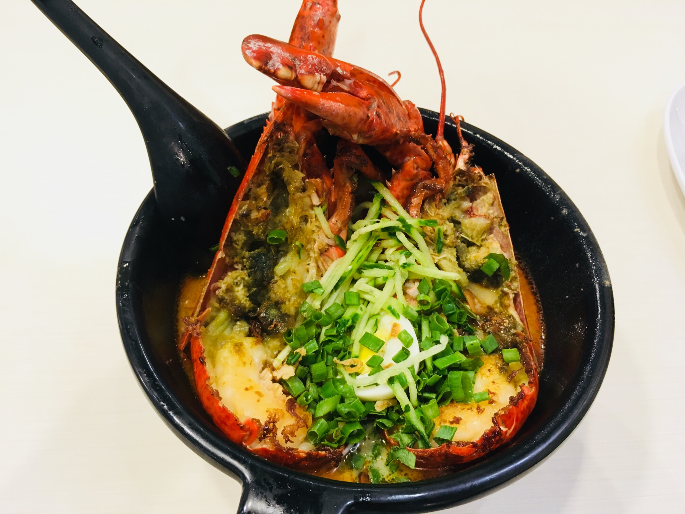
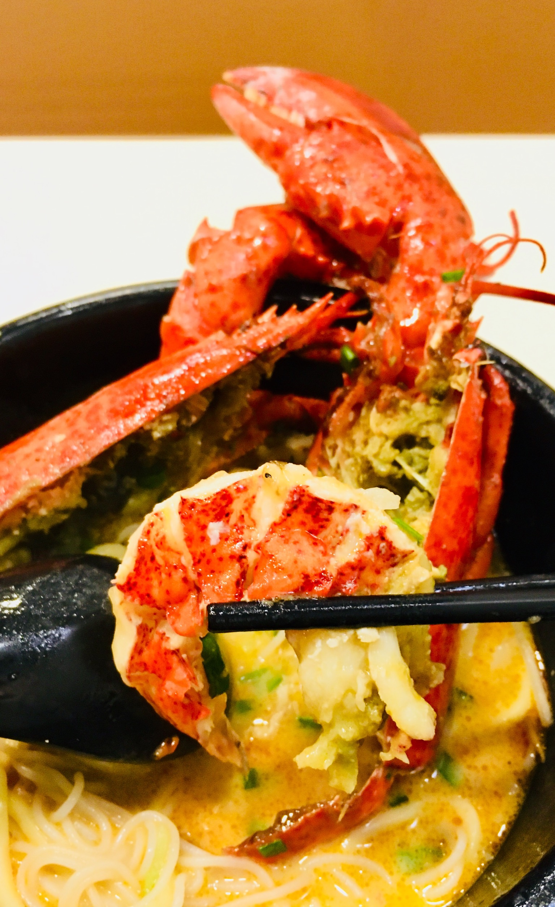
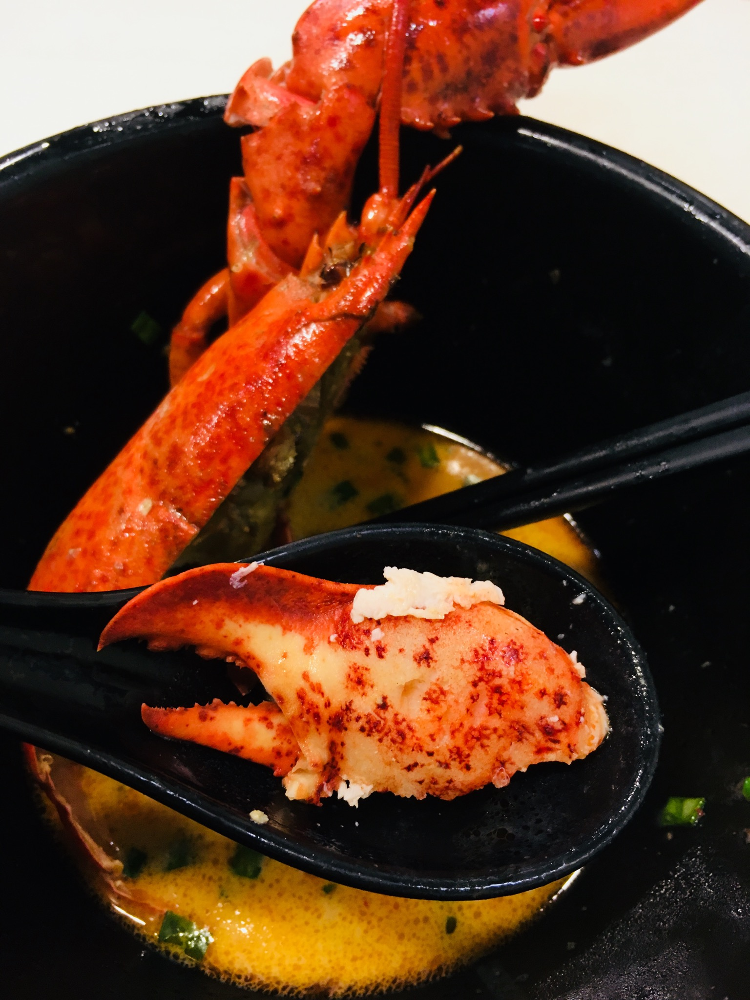

今天趁着办理tax clearance的当儿，出去拔草小叻沙！
直接上图好吧
波士顿龙虾叻沙！ 

<!-- 

 -->

第一次吃这么完完整整的龙虾，没想到虾的壳竟然是韧韧的那种，不像蟹壳很脆，肉也是很有嚼劲。

饭后去了湾仔的电脑城，虽然店铺分布来看真的和大陆的数码城看起来差不多，乍一看也会觉得是小商小贩买卖二手电脑，仿制配件的聚居地，但实际上，这边还真没有便宜货。。本来想买的天猫上68的pad保护套。。。在这边最便宜的都要198hkd。。还有一家店铺直接就说最便宜也要两百多。。看来网上说的hk无假货是真真的了。

回去的路上看到微博的新闻，说是国产自主研发的浏览器内核“红芯”在拨款2.5亿后终于杀青，结果网友对应用宝不断解压以后发现，文件目录里面chrome的文件属性名都没改。。后面网友评论说“你不是亿万富翁，那是你太老实了”。哎，叹口气吧。

在inland revenue等税单的时候看到票圈有人转“方便喷鹿晗的甜蜜暴击”，说误导搏击运动。本来我自己看微博上的视频片段的时候就觉得，这小细胳膊小细腿的，实在是没有形象的代入感，但是不得不说，作为流量小花，确实为搏击运动带去了宣传，从这点上来说，也喷不得。但是后来看到方便又评论道，当时激战拍片的时候，彭于晏和张家辉为了塑造形象，特地去健身，了解综合格斗，这种敬业精神确实鹿晗比不了。微博上那些粉丝一看到鹿晗打拳健身就心疼的不得了，一方面是人设使然，但另一方面，既然人设是这样，为什么要去尝试这样不合适的角色呢。